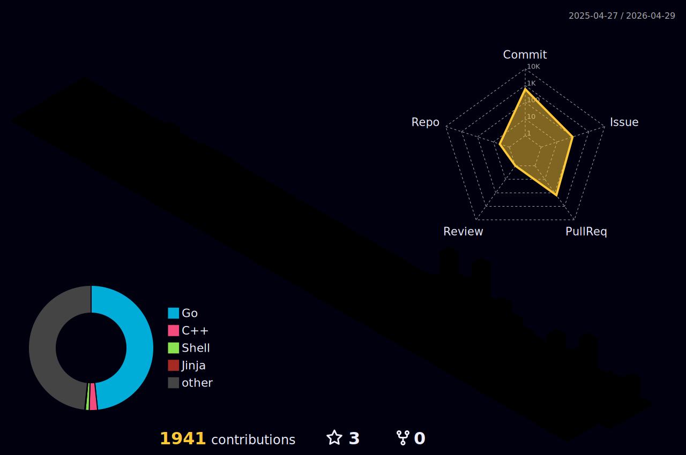

  
 <h1 align="center">Hi there 👋, I'm HAN </h1>
<h3 align="center">Backend & Game Developer | Go/C#/C++ Enthusiast | Building high‑performance stuff</h3>

### 🚀 About Me

* 🗺️  Originally from **Taiwan**, now crafting code in **Dublin, Ireland**
* 🎮  Designing **Andromeda** – a lock‑step C++ combat‑engine framework
* 💼  5+ yrs building **Go** micro‑services at scale (GCP, Kubernetes, Grafana, Prometheus)
* 🌱  Currently exploring **fixed‑point** for lock-step sync mechanism

### 🛠 Tech Stack

### 📈 GitHub Stats

  

### 🌟 Featured Projects

| Repo                                                                           | Description                              | Tech               |
| ------------------------------------------------------------------------------ | ---------------------------------------- | ------------------ |
| [**andromeda-linux-cpp**](https://github.com/silver2dream/andromeda-linux-cpp) | High‑performance C++ TCP server framework| C++, Docker, CMake |
| [**alpheratz**](https://github.com/silver2dream/alpheratz)                     | Lightweight structured logging library   | C++                |
| [**leetcode-go**](https://github.com/silver2dream/leetcode-go)                 | My LeetCode journey                      | Go                 |

