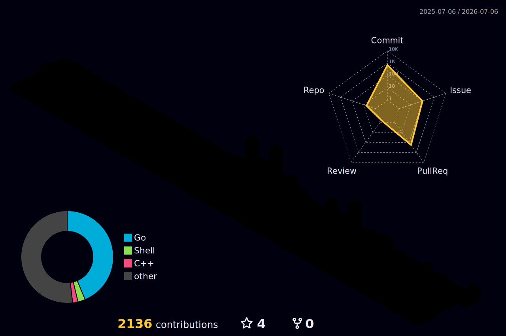

<h1 align="center">HAN</h1>
<p align="center"><code>backend & game dev</code></p>
<br>

```
I build things that run fast and think for themselves.
```

<br>

<table align="center">
<tr><td><b>Stack</b></td><td>Go · C++</td></tr>
<tr><td><b>Domain</b></td><td>Real-time combat systems · AI-powered dev workflows · High-performance networking</td></tr>
</table>

<br>

### Selected Works

[**claude-agent-farm**](https://github.com/silver2dream/claude-agent-farm) — Self-hosted multi-agent system on K3s. One Discord bot, multiple isolated Claude Code agents, zero cloud dependency.

[**ai-workflow-kit**](https://github.com/silver2dream/ai-workflow-kit) — Spec → Implement → PR → Merge. An AI-driven development workflow engine written in Go.

[**andromeda-linux-cpp**](https://github.com/silver2dream/andromeda-linux-cpp) — High-performance C++ TCP server framework. Master-worker architecture, epoll multiplexing, custom memory pool.

<br>

---

<a href="./profile-3d-contrib/profile-night-rainbow.svg">
    
</a>
